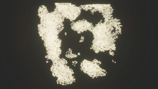

# cellauto3d


3D cellular automata with the [Bevy](https://crates.io/crates/bevy) game engine.

## Features

* camera control using [bevy_panorbit_camera](https://crates.io/crates/bevy_panorbit_camera)
* parallel computation using [rayon](https://crates.io/crates/rayon)
* color selection using [colorgrad](https://crates.io/crates/colorgrad)
* basic in-game controls
* command line interface
* specify minimum and maximum population density in order to allow growth/shrinking cycles

### _Warning:_

May produce flashing lights.

## Compile and run

To download and compile, run

```bash
git clone https://www.github.com/elkasztano/cellauto3d && \
cd cellauto3d && \
cargo build --release
```

To compile and run in one go, navigate to the `cellauto3d` directory, then type

```
cargo run --release
```

### Prerequisites for the Bevy game engine

Depending on your system, you may need to install some dependencies as described here:

[https://github.com/bevyengine/bevy/blob/main/docs/linux_dependencies.md](https://github.com/bevyengine/bevy/blob/main/docs/linux_dependencies.md)

## Command line options

### -h, --help

Show verbose help text including default values.

### -d, --density

`f64` floating point number specifying the density of the cubes at start. Ranges from 0.0 to 1.0.

A density of e.g. 0.5 means that roughly every other spot in the system is populated at the beginning.

### -s, --seed

`u64` integer seed for the pseudorandom number generator used to create the initial state.

### -e, --edge-length
Integer value that defines the edge length of the space in which the automata live. Defaults to 64, which results in a 64x64x64 block system.

### --maximum
`f64` floating point number that defines the maximum density of spawned cubes. Ranges from 0.0 to 1.0. If the specified density is reached after a period of growth, no more new blocks will be spawned. Only despawning is allowed according to the defined rules, until the system has shrunk to the minimum. (see below)

### --minimum
`f64` floating point number that defines the minimum density at which growth of the system is allowed again. Ranges from 0.0 to 1.0.

### -c, --color-gradient
Select color preset. The cubes are colored by choosing a color from the specified gradient. A newly spawned cube will have a slightly different color than its predecessors.

### -l, --light-mode
Select lighting preset.

### --fullscreen
Select fullscreen mode.

### -r, --rules
String that defines the rules of the system.

#### Example:
`'5-6/5/3/M'` will result in the following rules:
* cells with five or six neighbours will survive
* new cells will spawn in empty spots with exactly five neighbours
* living cells have three states - if the survival conditions are not met, life will be reduced by one until it reaches zero, then the cube will despawn
* The 'M' at the end stands for Moore neighbourhood. Another possible option is 'VN', for the Von Neumann neighbourhood.

### -f, --divisor
While in game, the user can hit 'm' to spawn new cubes in the center of the system. The size of this volume is defined by `edge_length / divisor + 1`, so in a 64x64x64 system a value of 10 will result in a 7x7x7 block in the center of the system in which new blocks are spawned.

### --core-density
`f64` floating point number defining the density of spawned cubes in the above specified center area when hitting 'm'.

## In-game options

By default the camera is controlled with the mouse as described [here](https://github.com/Plonq/bevy_panorbit_camera).

Hit `H` to show help information.

Hit `A` to accelerate, and `S` to slow the system down.

Hit `SPACE` to stop the system entirely.

Hit `N` to spawn new cubes pseudorandomly in the entire volume.

Hit `M` to spawn new cubes in the center.

Hit `R` to temporarily disable mouse control and start a simple orbit animation, i.e. rotate around the system.

Press `esc` or `Q` to quit.

## Example commands

`cellauto3d` will run fine without any parameters:
```bash
cargo run --release
```

Basic example resulting in cloud-like structures and a growth/shrinking cycle.  Fullscreen mode and the 'bloom' effect is on:

```bash
cargo run --release -- -r "5-6/5/3/M" --maximum 0.1 --minimum 0.02 -c rainbow -l bloom -d 0.01 -s 9999999999 --fullscreen
```

Slower growth, let some smaller structures survive:

```bash
cargo run --release -- -c rainbow -l bloom --minimum 0.05 -r "3,6/6/4/M"
```

Hit `M` to start the simulation. Reaches a state with two oscillators and some stators after a few cycles:

```bash
cargo run --release -- -c rainbow -l bloom --minimum 0.063 -r "3,6/6/4/M" -d 0.0
```

Interesting growth pattern:

```bash
cargo run --release -- --minimum 0.04 --maximum 0.1 -r "5-10/6-7/4/M" -d 0.12 -s 42
```

## References

[https://conwaylife.com/wiki/Three-dimensional_cellular_automaton](https://conwaylife.com/wiki/Three-dimensional_cellular_automaton)

[https://softologyblog.wordpress.com/2019/12/28/3d-cellular-automata-3/](https://softologyblog.wordpress.com/2019/12/28/3d-cellular-automata-3/)